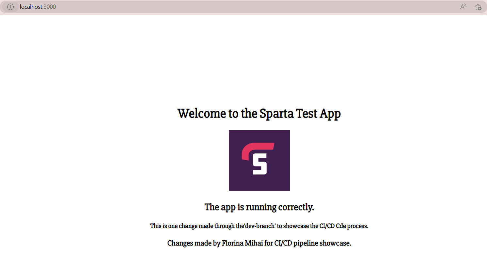
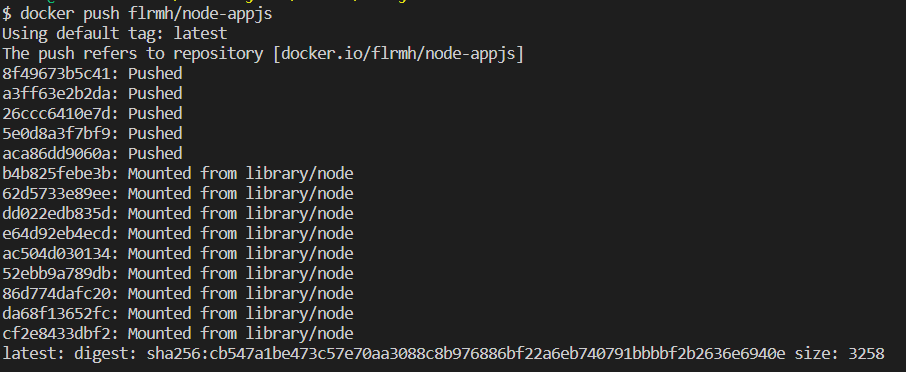

# Docker


## What is Docker?

***Docker*** is an open platform for developing, shipping, and running applications. Docker enables you to separate your applications from your infrastructure so you can deliver software quickly.
- With Docker, you can manage your infrastructure in the same ways you manage your applications. 
- By taking advantage of Docker’s methodologies for shipping, testing, and deploying code quickly, you can significantly reduce the delay between writing code and running it in production.


### Benefits:

- Can be started within seconds, as a Docker container is just a process running on the operating system.
- Ensures faster deployment -> With Docker, you do not have to create a new environment and only have to download the Docker image to run on a different server.
- Allows you to scale and maintain the containers efficiently -> You can run multiple containers containing isolated applications on the same host or server.
- Docker containers require fewer resources, as these are being shared by multiple containers running on the same server.
- You can install and run Docker on various platforms using Docker images, like Windows, Linux, and macOS.

---

## Containerization vs Virtualization

Virtualization and containerization are two different technologies used to optimize and manage server resources. 
- The main difference between the two is that **virtualization** involves *creating virtual machines (VMs) that mimic the functionality of physical machines*, while **containerization** involves *creating isolated environments on a single operating system*.

### 1. Virtualization:
In virtualization, the hypervisor creates multiple virtual machines, each with its own operating system, to run different applications. 
- Each VM runs on top of the host's hardware, and the hypervisor manages the allocation of resources such as CPU, memory, and storage to the VMs. - This allows multiple operating systems to run simultaneously on a single physical server, making more efficient use of hardware resources.

### 2. Containerization:
In containerization, the container engine creates multiple containers, each running its own application, on top of a single operating system.
- Each container shares the operating system kernel, libraries, and other resources, but has its own isolated file system and network interfaces.
- This allows multiple applications to run in isolation from one another, while still using the same operating system and hardware resources, making more efficient use of the underlying infrastructure.

Overall, virtualization provides greater isolation between applications, while containerization offers greater efficiency and flexibility, especially in the context of cloud computing and microservices architectures.

---

## Docker architecture


The Docker architecture can be divided into three main components:

1. Docker daemon.
- This is the core component of the Docker architecture, which runs on the host machine and manages the containers. 
- The daemon listens for Docker API requests and performs tasks like building, running, and distributing containers.

2. Docker client. 
- The client is the command-line interface (CLI) tool that allows users to interact with the Docker daemon. 
- The client sends commands to the daemon using the Docker API, which the daemon then executes. 
- The client can be installed on the same machine as the daemon or on a remote machine that connects to the daemon over the network.

3. Docker registry. 
- The registry is a central repository that stores Docker images.
- An image is a read-only template that contains the instructions to create a Docker container. 
- The registry can be either public (such as Docker Hub) or private (such as a company's internal registry), and images can be pushed to or pulled from the registry by the Docker client.

When a user wants to create a container, they use the Docker client to issue commands to the Docker daemon, which then executes the command and creates the container. The container is created from a Docker image, which can be either downloaded from a registry or built locally using a Dockerfile.

Once the container is running, it has its own isolated file system, network interfaces, and process namespace, but shares the kernel with the host operating system. This allows multiple containers to run on a single host machine while maintaining isolation from one another. The Docker daemon manages the resources allocated to each container and can monitor their status and performance.

---
## Installing Docker
- First, we need to create a `Docker hub` account.
- We can do that by usingthe following link:

[Docker Hub sign up](https://hub.docker.com/signup)

- Once the account has been created, you will most likely be prompted to install `Docker desktop` for your current OS (Yes, Docker is smart like that. It recognises the OS you are running and prompts you for the download page of the software according to your OS).
- If you have not been automatically prompted to download `Docker desktop` after creating the `Docker hub` account, follow the link below:

[Docker Desktop download](https://www.docker.com/products/docker-desktop/)

- When the download finished, run the .exe file.
- You might need to restart your computer to finish the installation. 
- Once you restarted you computer (if asked to do so), Make sure that you run the `Docker desktop` as `admin`. 
- If the installation went well, open a `git bash` as `admin` and run:
```
docker

docker --version
# must be docker 20.x
```
- To test that `Docker desktop` is workin properly, run the following in the `git bash` terminal:
```
docker run hello-world

# should outputs the following message 
Hello from Docker!
This message shows that your installation appears to be working correctly.
```

- There are also some settings we have to ensure in `Docker desktop`. So, please open `Docker desktop` and go to `Settings`. 
- Your settings should look like this:


- This is to ensure that `docker` runs as soon as we boot up our machine and that is using `WSL2`. 
- When you boot up your machine, if you expect `Docker desktop` to run as soon as the system starts, you should be able to check via `Show hidden icons` arrow on your toolbar.


- If the icon is red, it means that `Docker desktop` is not running, so it is worth restarting the `Docker daemon(Docker desktop)`.


---

## Docker commands
- To find out the Docker commands, we can simply run in the CLI:
```
docker
```
- The output will look like this:

```
Usage:  docker [OPTIONS] COMMAND

A self-sufficient runtime for containers

Options:
      --config string      Location of client config files (default
                           "C:\\Users\\flori\\.docker")
  -c, --context string     Name of the context to use to connect to the
                           daemon (overrides DOCKER_HOST env var and
                           default context set with "docker context use")
  -D, --debug              Enable debug mode
  -H, --host list          Daemon socket(s) to connect to
  -l, --log-level string   Set the logging level
                           ("debug"|"info"|"warn"|"error"|"fatal")
                           (default "info")
      --tls                Use TLS; implied by --tlsverify
      --tlscacert string   Trust certs signed only by this CA (default
                           "C:\\Users\\flori\\.docker\\ca.pem")
      --tlscert string     Path to TLS certificate file (default
                           "C:\\Users\\flori\\.docker\\cert.pem")
      --tlskey string      Path to TLS key file (default
                           "C:\\Users\\flori\\.docker\\key.pem")
      --tlsverify          Use TLS and verify the remote
  -v, --version            Print version information and quit

Management Commands:
  builder     Manage builds
  buildx*     Docker Buildx (Docker Inc., v0.10.3)
  compose*    Docker Compose (Docker Inc., v2.15.1)
  config      Manage Docker configs
  container   Manage containers
  context     Manage contexts
  dev*        Docker Dev Environments (Docker Inc., v0.1.0)
  extension*  Manages Docker extensions (Docker Inc., v0.2.18)
  image       Manage images
  manifest    Manage Docker image manifests and manifest lists
  network     Manage networks
  node        Manage Swarm nodes
  plugin      Manage plugins
  sbom*       View the packaged-based Software Bill Of Materials (SBOM) for an image (Anchore Inc., 0.6.0)
  scan*       Docker Scan (Docker Inc., v0.25.0)
  scout*      Command line tool for Docker Scout (Docker Inc., v0.6.0)
  secret      Manage Docker secrets
  service     Manage services
  stack       Manage Docker stacks
  swarm       Manage Swarm
  system      Manage Docker
  trust       Manage trust on Docker images
  volume      Manage volumes

Commands:
  attach      Attach local standard input, output, and error streams to a running container
  build       Build an image from a Dockerfile
  commit      Create a new image from a container's changes
  cp          Copy files/folders between a container and the local filesystem
  create      Create a new container
  diff        Inspect changes to files or directories on a container's filesystem
  events      Get real time events from the server
  exec        Run a command in a running container
  export      Export a container's filesystem as a tar archive
  history     Show the history of an image
  images      List images
  import      Import the contents from a tarball to create a filesystem image
  info        Display system-wide information
  inspect     Return low-level information on Docker objects
  kill        Kill one or more running containers
  load        Load an image from a tar archive or STDIN
  login       Log in to a Docker registry
  logout      Log out from a Docker registry
  logs        Fetch the logs of a container
  pause       Pause all processes within one or more containers
  port        List port mappings or a specific mapping for the container
  ps          List containers
  pull        Pull an image or a repository from a registry
  push        Push an image or a repository to a registry
  rename      Rename a container
  restart     Restart one or more containers
  rm          Remove one or more containers
  rmi         Remove one or more images
  run         Run a command in a new container
  save        Save one or more images to a tar archive (streamed to STDOUT by default)
  search      Search the Docker Hub for images
  start       Start one or more stopped containers
  stats       Display a live stream of container(s) resource usage statistics
  stop        Stop one or more running containers
  tag         Create a tag TARGET_IMAGE that refers to SOURCE_IMAGE
  top         Display the running processes of a container
  unpause     Unpause all processes within one or more containers
  update      Update configuration of one or more containers
  version     Show the Docker version information
  wait        Block until one or more containers stop, then print their exit codes

Run 'docker COMMAND --help' for more information on a command.

To get more help with docker, check out our guides at https://docs.docker.com/go/guides/
```
---

## Pulling an image from the `Docker registry` (`Docker Hub`)

### Docker main commands:
1. docker pull = pull an image from the registry.
2. docker run = pull an image from registry(if not locally available) and execute it in a conatiner. 
3. docker build = build an image from scratch.

- We will now attempt to pull an image that contains `nginx`.
- In the `Docker Hub/ Docker registry` there are thousands of images available created by contributors. It is best to check that the image you will pull has been built by a verified contributor or it is an official image.


- Now that we know that the image we need is an official image, we need to open a `git bash` terminal as `admin`.
- Once in the `git bash` terminal, run the command:
```
docker run -d -p 80:80 nginx

# you should receive a long id as an output which means that the image has been pulled and a container has been created where the image is running
```
- To test that a container has been created and the nginx image is running correctly inside the container, go on your browser and in the search bar type:
```
localhost
```
- In your browser, you should be now able to see the `nginx homepage`.


- If you would like to check the containers that are currently running, run the following command:
```
docker ps
```


- The output will show the container ID, the image that the container is running, etc.

#### !!! Please note: If you do not assign a name to the container, it will receive a random name from `docker`. E.g., in the screenshot attached, the random name assigned is "cranky_dijkstra". 

---
- If you want to destroy/stop the container, you can do that by running:
```
docker rm <container_id> -f 
# will force stop it and remove it even if it is running

docker stop <container_id>
# will stop the container from running
# stops it at that stage, and when you run it again, everything will be the same as the last time you used it (changes are saved)
```

- If the container has been stopped and removed, if the image is still available locally, you can run the image again and a new container running the same image will be created.

---

- If we want to communicate with the container, we can actually do that (like an ssh into a VM). We need to make sure the container is running first (which we did using `docker ps`). 
- There is a potential blocker for `Windows` users, but we will sort that out if it is the case.
```
docker exec -it <container id> /bin/bash
# this might not work, so instead use the following

docker exec -it <conatiner id> sh
# this command will most likely prompt the need for an alias, such as "winpty" -> this is the Windows blocker that I mentioned earlier

alias docker="winpty docker"
# this is the command to overcome the blocker

# now attempt to run the command again 
docker exec -it <conatiner id> sh

# this should prompt "#" at the beginning of the command line = we are inside the container

```

- Once inside the container, we do not know anything about this environment, sp we need to run some commands to find out.
```
uname 

uname -a
```
- Now that we found out what OS this container has (in my case it is Linux), we can start navigating through it and communicate with it.
```
pwd
# we will most likely be in the root folder (/)
```
- This container is going to be an empty machine, as it has no dependencies installed. 
- So, if we wanted to create a file, we need to use `nano` text editor. However, as this is an empty machine, it won`t even have `nano installed. 
- Let`s run some commands to establish the internet connection and install some dependencies:
```
apt update -y

apt upgrade -y

apt install nano 


# let`s navigate to the file that holds the static website information and configuration for the homepage of nginx

cd /usr
cd share
cd nginx
cd html
ls 
#should see an index.html file

# now, because we installed nano, let`s change the configuration for the index.html file

nano index.html


```
- The default configuration for `index.html` will look like this:


- I will now make a change to `h1`, so my `index.html` will look like this:

- Save the file (`CTRL+X, Y, Enter`). 
- Check the file content to make sure the changes are saved:
```
cat index.html
```
- If your changes are made, go to your browser and type in:
```
lohalhost
```
- If everything went well, you should see your changes to the `nginx homepage`. 


- To leave the controller and return to the localhost, simply run `exit` in the CLI.

---
## Exercise: Deploy our app in a docker container
- First, we need to create a new folder `nodejs` in our `docker` folder.


- We need to copy our app folder within the `nodejs` folder, so we can have our app code available.
- We need to create a new `Dockerfile` within the `nodejs` folder.
- Within the `Dockerfile` we will put the script for our image so they can be executed when we run the image.


- Make sure you are in the right location in the git bash terminal:
```
 ls

# should output
 app/  Dockerfile
```
- And now let`s build the image:
```
docker build . -t nodeapp
```
- This will output:
```
[+] Building 26.3s (11/11) FINISHED
 => [internal] load build definition from Dock  0.0s 
 => => transferring dockerfile: 334B            0.0s 
 => [internal] load .dockerignore               0.0s 
 => => transferring context: 2B                 0.0s 
 => [internal] load metadata for docker.io/lib  2.1s 
 => [auth] library/node:pull token for registr  0.0s 
 => [1/5] FROM docker.io/library/node:latest@  17.9s 
 => => resolve docker.io/library/node:latest@s  0.0s 
 => => sha256:fe9a4b9e181a9dd1 7.51kB / 7.51kB  0.0s 
 => => sha256:83841d113e09345a 1.21kB / 1.21kB  0.0s 
 => => sha256:5b1b50e1f3f59431 2.21kB / 2.21kB  0.0s 
 => => sha256:32fb02163b6bb5 55.05MB / 55.05MB  3.6s 
 => => sha256:167c7feebee855d1 5.17MB / 5.17MB  0.8s 
 => => sha256:d6dfff1f6f3ddd 10.88MB / 10.88MB  2.4s 
 => => sha256:e9cdcd4942ebc7 54.59MB / 54.59MB  6.0s 
 => => sha256:ca3bce705f6 196.81MB / 196.81MB  12.4s 
 => => sha256:4f4cf292bc62eeea 4.21kB / 4.21kB  3.7s 
 => => extracting sha256:32fb02163b6bb519a30f9  1.0s 
 => => sha256:8347f8b4b86bb4 46.16MB / 46.16MB  6.9s 
 => => extracting sha256:167c7feebee855d117e19  0.1s 
 => => extracting sha256:d6dfff1f6f3ddd2194ea0  0.1s 
 => => sha256:c5f20f1b08565a46 2.28MB / 2.28MB  6.3s 
 => => extracting sha256:e9cdcd4942ebc7445d8a7  1.1s 
 => => sha256:d220dfa3e18768d4b6be 449B / 449B  6.5s 
 => => extracting sha256:ca3bce705f6c47c25b6e7  3.6s 
 => => extracting sha256:4f4cf292bc62eeea8a34b  0.0s 
 => => extracting sha256:8347f8b4b86bb4cef9be4  1.0s 
 => => extracting sha256:c5f20f1b08565a46ecc13  0.1s 
 => => extracting sha256:d220dfa3e18768d4b6bef  0.0s 
 => [internal] load build context               1.3s 
 => => transferring context: 27.93MB            1.3s 
 => [2/5] RUN mkdir -p /app/src                 1.4s 
 => [3/5] WORKDIR /app/scr                      0.0s 
 => [4/5] COPY app .                            0.5s 
 => [5/5] RUN npm install                       3.8s 
 => exporting to image                          0.4s 
 => => exporting layers                         0.4s 
 => => writing image sha256:4a82e2b750c7fa9245  0.0s 
 => => naming to docker.io/library/nodeapp      0.0s 
```
- Let`s check that the image exists:
```
docker images
```
- You should be able to see the newly vcreated image.
- And now, we need to run the image and create a container that executes the `Dockerfile`.
```
docker run -d -p 3000:3000 nodeapp
```
- We are now ready to check our app in the web browser:



- Once we are sure that the app is working, we can commit the image and push it to our `Docker registry/Docker Hub`. 

```
docker commit <container id of the app running>  flrmh/node-appjs

docker push flrmh/node-appjs
```
- The push command output should look like this, which means that it is creating the repo on `Docker Hub`:



- Once ready, you can check on your `Docker Hub` that the repo has been created and it holds the image. 
- Now, you can easily delete your local image and container and pull it from the `Docker Hub` repo when you need to use it. 


- Happy days! We created an image for our app which will allow us to see the app running each time we run the image and create a container with it. :)