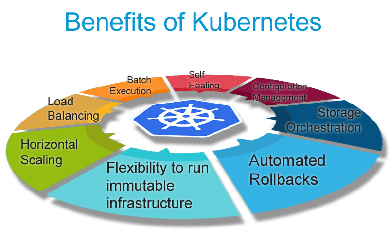
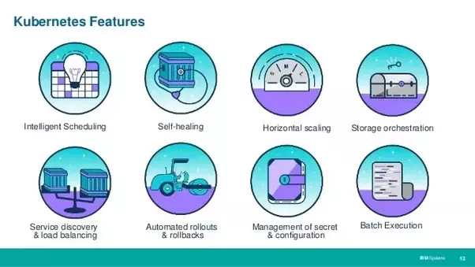
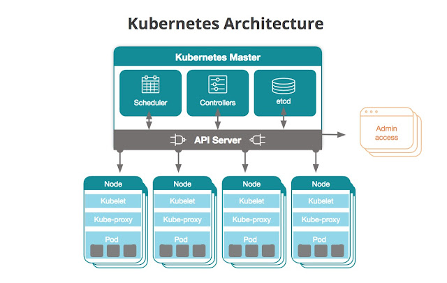
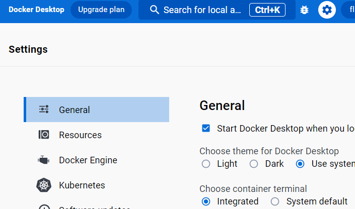
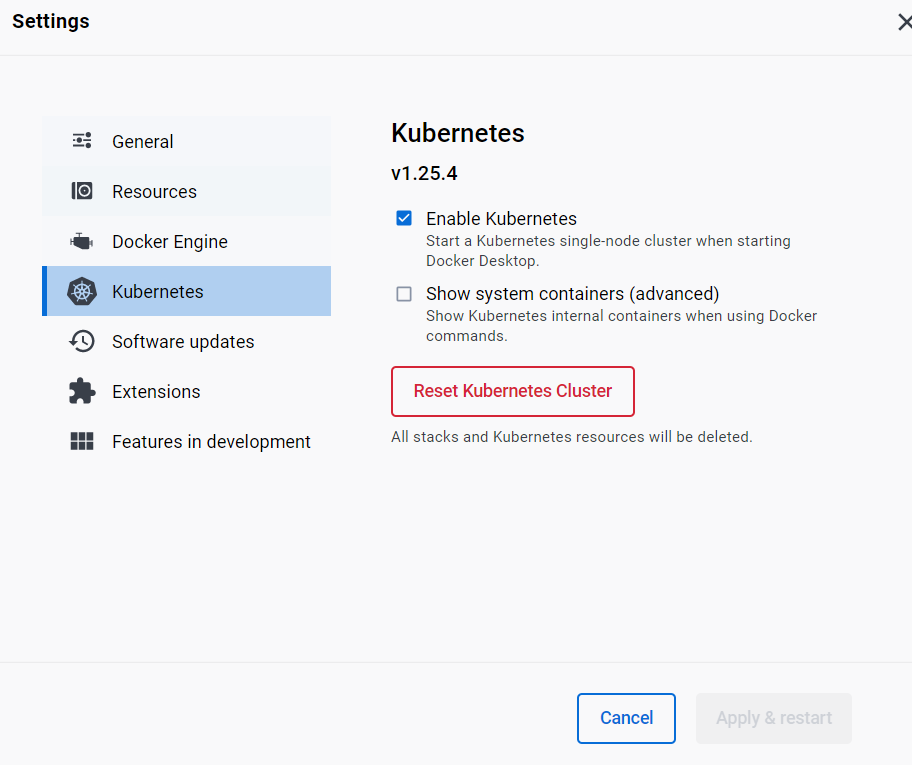
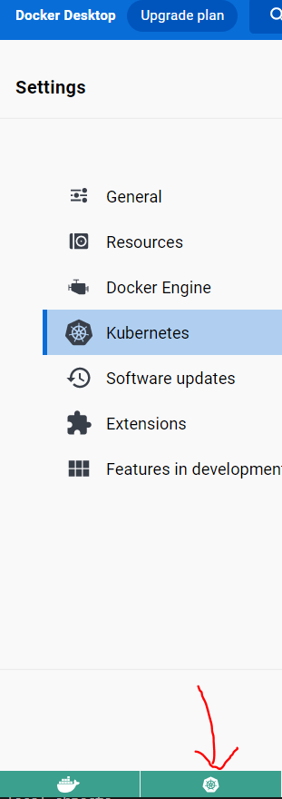

# Kubernetes (K8s)

**Kubernetes (also known as "K8s")** is an *open-source platform used to automate the deployment, scaling, and management of containerized applications*.
- In other words, **Kubernetes** allows you to *orchestrate and manage your containers* so you can focus on developing your application, *without having to worry about infrastructure management*.

 

- **Scalability**: easily scale their applications up or down based on demand.

- **High availability**: built-in features for high availability, such as automated failover and self-healing.

- **Resource efficiency**: optimizes resource utilization by automatically scheduling containers based on resource requirements and availability.

- **Portability**: provides a consistent platform for deploying and managing applications across different environments, such as on-premise data centers and cloud providers.

- **Simplified management**: provides a unified platform for managing containerized applications, simplifying the deployment, scaling, and management of applications.

- **Extensibility**: provides a rich set of APIs and allows users to extend its functionality through custom resources and controllers (integration with other toold for automation of complex workflows).
---

## Kubernetes architecture

### 1. ***Kubernetes objects***
- *Persistent entities* in the `Kubernetes system`. 
- `Kubernetes` uses these `entities` to **represent the state of your cluster**. 
- Specifically, they can describe:

a. **What containerized applications are running (and on which nodes)**.

b. **The resources available to those applications.**

c. **The policies around how those applications behave, such as restart policies, upgrades, and fault-tolerance.**
- A `Kubernetes object` is a **"record of intent"**--once you create the object, the `Kubernetes system` will **constantly work to ensure that object exists**. 
- By creating an `object`, you're effectively **telling the `Kubernetes system` what you want your cluster's workload to look like**; this is your cluster's desired state.

- To work with `Kubernetes objects`--whether to **create, modify, or delete** them--you'll need to use the `Kubernetes API`. 
- When you use the `kubectl` command-line interface, for example, the **CLI makes the necessary `Kubernetes API` calls for you**. 
- You can also use the `Kubernetes API` **directly in your own programs using one of the Client Libraries**.




### 2. ***Kubernetes Master node*** 
- The **`Master node`** is *responsible for managing the overall state of the cluster*. 

It includes several components:

a. **API Server**
- **exposes the `Kubernetes API`**, which is *used by clients (such as `kubectl`) to interact with the `cluster`*.
- The `API server` **exposes an HTTP API that lets end users, different parts of your cluster, and external components communicate with one another**.

- The `Kubernetes API` lets you **query and manipulate the state of API objects in Kubernetes (for example: Pods, Namespaces, ConfigMaps, and Events)**.

b. **etcd**
- **a distributed key-value store** used to *store the configuration and state information of the `cluster`*.

c. **Controller Manager**
- **responsible for maintaining the desired state of the `cluster`** by *running various controllers (such as the Replication Controller and Deployment Controller)*.

d. **Scheduler**
- **responsible for scheduling workloads onto the `worker nodes` in the cluster**.

### 3. ***Worker node***
- The **`worker node`** is *responsible for running containerized applications*. 

It includes several components:

a. **kubelet**
-  **responsible for communicating with the `Kubernetes Master node`** and *managing the containers on the `node`*.

b. **kube-proxy** 
- **responsible for network proxying on the `worker node`**.


c. **Container runtime**
- **software that runs the containerized applications (such as `Docker`)**.


Overall, the architecture of **`Kubernetes`** is designed to be **highly scalable and fault-tolerant**. 

By *distributing the workload across multiple worker nodes and using a distributed key-value store for configuration and state management*, **Kubernetes** is able to *provide a highly available and resilient platform for running containerized applications*.

---
## Difference between Single-node Cluster and Multi-node Cluster

### 1. Single-node Cluster
A `single-node Kubernetes cluster` can be useful for **development and testing environments**, or for **small-scale deployments** where high availability is not a primary concern. 
- A `single-node cluster` **runs all of the Kubernetes components (master and worker) on a single machine**, making it *easy to set up and manage*

### 2. Multi-node Cluster
A `multi-node Kubernetes cluster` is more suitable for **production workloads that require high availability, scalability, and fault tolerance**. 
- A `multi-node cluster` consists of **multiple worker nodes running containers and a master node that manages the overall state of the cluster**. 
- This architecture provides **better performance, reliability, and scalability by distributing the workload across multiple nodes**.


### Factors to consider when choosing between the two:
1. **Application requirements**
-  Does your application require **high availability, scalability, and fault tolerance**?
- If so, a `multi-node cluster` is likely the better choice.
2. **Resource availability** 
- Do you have the **resources (e.g. physical machines or cloud instances) to support a multi-node cluster**? 
- If not, a `single node cluster` may be a more practical option.
3. **Cost** 
- `Multi-node clusters` can be **more expensive to set up and manage** than `single node clusters` due to the *additional resources required*.

---

## Installing Kubernetes
Pre-requisits:
- `Docker` installed.
- `Docker desktop` running.

1. Go to your `Docker desktop` and access the `Settings`.



2. You should be able to see `Kubernetes` as a tab in your `docker desktop` settings. Please access the `Kubernetes` tab. 



3. Ensure that the `Enable Kubernetes` box is ticked. Once ticked, please select `Apply & restart` on the bottom right.

!! **Please note**: You might be required to restart your machine. If prompted to do so, please restart in order to save the changes.

Also, the process of applying these changes will take a long time and `Kubernetes` is a heavy-duty tool. 

4. Once ready, you should be able to see both `Docker desktop` and `Kubernetes` running.



---

## Extra:
 To see the `kubernetes` commands, please open a `git bash` terminal and run the following:
 ```
kubectl

# The output will look like this 

kubectl controls the Kubernetes cluster manager.

 Find more information at: https://kubernetes.io/docs/reference/kubectl/

Basic Commands (Beginner):
  create          Create a resource from a file or from stdin
  expose          Take a replication controller, service, deployment or pod and expose it as a new Kubernetes service
  run             Run a particular image on the cluster
  set             Set specific features on objects

Basic Commands (Intermediate):
  explain         Get documentation for a resource
  get             Display one or many resources
  edit            Edit a resource on the server
  delete          Delete resources by file names, stdin, resources and names, or by resources and label selector

Deploy Commands:
  rollout         Manage the rollout of a resource
  scale           Set a new size for a deployment, replica set, or replication controller
  autoscale       Auto-scale a deployment, replica set, stateful set, or replication controller

Cluster Management Commands:
  certificate     Modify certificate resources.
  cluster-info    Display cluster information
  top             Display resource (CPU/memory) usage
  cordon          Mark node as unschedulable
  uncordon        Mark node as schedulable
  drain           Drain node in preparation for maintenance
  taint           Update the taints on one or more nodes

Troubleshooting and Debugging Commands:
  describe        Show details of a specific resource or group of resources
  logs            Print the logs for a container in a pod
  attach          Attach to a running container
  exec            Execute a command in a container
  port-forward    Forward one or more local ports to a pod
  proxy           Run a proxy to the Kubernetes API server
  cp              Copy files and directories to and from containers
  auth            Inspect authorization
  debug           Create debugging sessions for troubleshooting workloads and nodes

Advanced Commands:
  diff            Diff the live version against a would-be applied version
  apply           Apply a configuration to a resource by file name or stdin
  patch           Update fields of a resource
  replace         Replace a resource by file name or stdin
  wait            Experimental: Wait for a specific condition on one or many resources
  kustomize       Build a kustomization target from a directory or URL.

Settings Commands:
  label           Update the labels on a resource
  annotate        Update the annotations on a resource
  completion      Output shell completion code for the specified shell (bash, zsh, fish, or powershell)

Other Commands:
  alpha           Commands for features in alpha
  api-resources   Print the supported API resources on the server
  api-versions    Print the supported API versions on the server, in the form of "group/version"
  config          Modify kubeconfig files
  plugin          Provides utilities for interacting with plugins
  version         Print the client and server version information

Usage:
  kubectl [flags] [options]

Use "kubectl <command> --help" for more information about a given command.
Use "kubectl options" for a list of global command-line options (applies to all commands).

# To see all the services running in a cluset, run the following:

kubectl get svc

# The output will have the following format:
NAME         TYPE        CLUSTER-IP   EXTERNAL-IP   PORT(S)   AGE

 ```